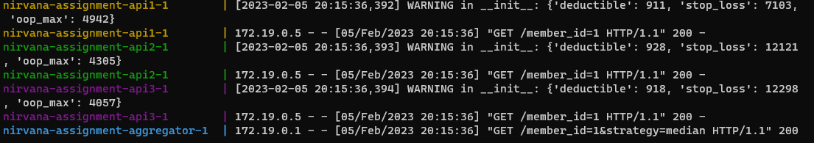
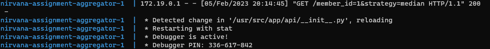

# Aggregator API
**A simple API that coalesces calls from multiple upstream APIs using a strategy specified in the request. All upstream APIs expose the same contract.**

## To run:
1. Execute in the root folder of the project 
```
docker-compose up
``` 
2. Open `http://localhost:5000/member_id=1&strategy=max` in your browser to see Aggregator API in action. 

3. To run unit tests (with coverage): 
```
pipenv run pytest --cov-report html --cov aggregator
```

## Implementation

[Aggregator API](./aggregator/__init__.py) uses [Flask](https://flask.palletsprojects.com) for basic web service wiring and [httpx](https://www.python-httpx.org/) 
for async calls to upstream APIs. Python environment is handled with [pipenv](https://pipenv.pypa.io). 
[Unit tests](./tests/test_aggregator.py) use [pytest](https://docs.pytest.org), [pytest-mock](https://pypi.org/project/pytest-mock/), 
and [pytest-httpx](https://pypi.org/project/pytest-httpx/) for mocking upstream APIs calls. 
[Pytest-cov](https://pypi.org/project/pytest-cov/) is used for verifying unit test coverage.

The project also relies on [docker compose](https://docs.docker.com/engine/reference/commandline/compose/) 
to run all the required services. 

[Upstream API](./api/__init__.py) is implemented as a simple Flask app that 
varies its responses randomly. For convenince, it outputs generated response to docker logs:



Aggregator is ready for debugging with [VSCode](https://code.visualstudio.com/). All relevant configuration is in the `.vscode` folder. To attach to the running container
simply press F5. Flask also monitors changes in source files and restarts the service accordingly:




## Possible further improvements
- Implement dev vs prod configuration
- Move strategy into a separate endpoint
